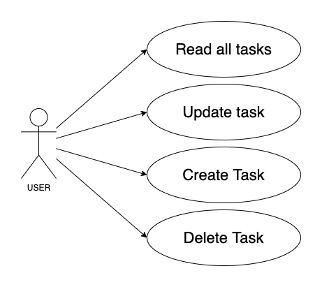
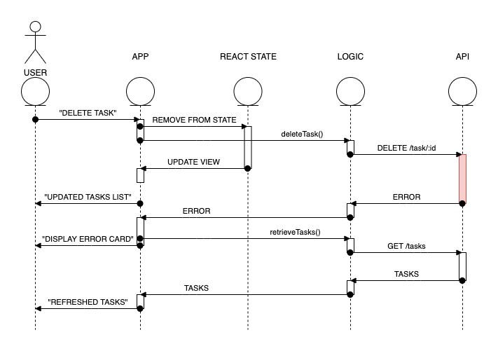

# List-it! - Client

## Introduction
A React app client for the [List-it API](../server).

URL: http://list-it.surge.sh

## How to run it

### IMPORTANT 
This app includes a [config file](./src/constants/index.js) to store the API URL. If you are running the API locally, edit this file to point to the correct local URL.

Also, for running this app you need to download and install the [commons](../commons) package.

### Install dependencies

```
$ npm install
```

### Run tests

```
$ npm test
```

### Run server

```
$ npm start
```

## Functional description

The user can list, create, update and delete tasks, giving them a title, description and priority.

### Use Cases




## Technical description

This app use build using React.js as framework for JavaScript. Styles using Sass.

### User experience over data integrity

To deliver a better user exerience, this app gives instant feedback to user actions, not waiting for the server response. Anyway, if there is any error and the action is not completed, it rollsback to the previous state and displays an error message.

Here an example with a delete action:

