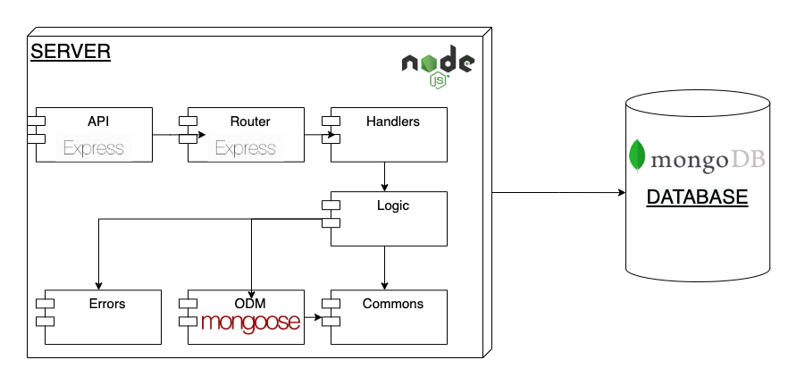

# List-it! - Server

## Introduction
A CRUD REST API for serving the [List-it app](../client).

URL: https://pasiona-list-it.herokuapp.com/api

## How to run it

### IMPORTANT 
To run this you need a `.env` file which is not included in this repository for security reasons. You can create your own by following this template:

```
PORT = <the port the server will be listening>
MONGODB_URL = <URL for local or remote MongoDB database>
MONGODB_URL_TEST = <URL for local or remote MongoDB database for testing>
```

Also, for running this API you need to download and install the [commons](../commons) package.


### Install dependencies

```
$ npm install
```

### Run tests

```
$ npm test
```

### Run server

```
$ npm start
```

### Other commands

#### Run server in watch mode (using [Nodemon](https://www.npmjs.com/package/nodemon)).
```
$ npm run watch
```

#### Run server in debug mode
```
$ npm run debug
```

#### Run tests in debug mode
```
$ npm run test-debug
```
## Functional description

### Endpoints

`GET /tasks` : retrieves all the tasks in database.

`POST /task` : creates a new task in database.

`PATCH /task/:id` : updates a task in database.

`DELETE /task/:id` : removes a task from database.


## Technical description

This API is build using Express.js and is connected

### Block diagram

